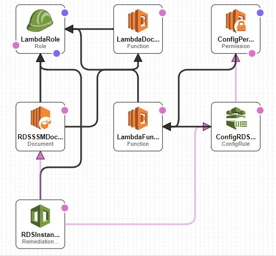

# tf-cf-opa-challenge

The Repo proves the capability of Terraform and OPA where users are restricted to modify the Subnets upon creation enforcing OPA validations in the process of Terraform apply.

### Prerequistes:

- AWS Cli is installed.
- AWS Configure is setup as per [Link](<https://docs.aws.amazon.com/cli/latest/userguide/cli-configure-files.html>)
- Docker is installed and setup properly- required for OPA docker to be pulled.
- Terraform 0.12.*
- Bucket in ap-southeast-2 to store terraform plan.
- Interface to execute the bash scripts.

### Steps:

- Clone the repo
    - git clone git@github.com:urspraveen2001/tf-cf-opa-challenge.git
- Navigate to cloned repo directory
- Create the new VPC, Subnet, Rds using below command.
    - ./scripts/create-resources.sh ***bucketName*** ***StateKeyfilename***
        - Creates 1 VPC, 2 Subnets and a RDS instance of mysql
- Create the cloudformation stack.
    - ./scripts/create-stack.sh ***stack-name***
- Wait for ~ 5 Mins for creation of all resources in the stack.
- Modify the created subnet by running below script to check OPA rejects the change(Modifying the subnet avialabilty zone from ap-southeast-2a to ap-southeast-2c)
    - ./scripts/update-resources.sh ***bucketName*** ***StateKeyfilename*** ap-southeast-2c
- Verify the AWS Config and SSM Document behaviour(To verify the automatic updation of the instanceProtection flag) run the below script
    - ./scripts/update-resources.sh ***bucketName*** ***StateKeyfilename***

### Deletion of the entire environment.
- Get the RDS DB Identifier which was created newly and run the below script.
    - ./scripts/delete-infra-resources.sh ***bucketName*** ***StateKeyfilename*** ***RDS_DB_Identifier*** ***stack-name***

### CF Stack Design

### Improvements
- In cloudformation stack restrict the IAM role permission to specific actions and resources.
- In Cloudformation stack create seperate IAM roles for different lambdas and SSM Document(Assume Role)
- Rely on the terraform docker instead of software installed on the machine.
- Create a docker image combining Terraform and OPA and change the scripts accordingly.
- Enchance the AWS SSM Document to achieve the goal in multiple steps rather than calling a Lambda to update the RDS Instance.